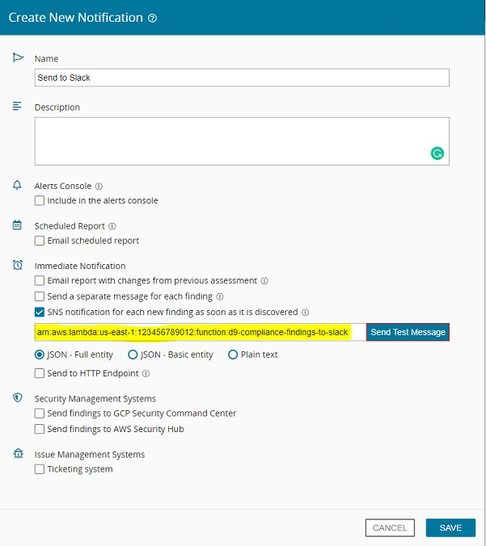

# Check Point Dome9 Compliance & Governance - Slack Integration 
AWS Lambda function which consumes Dome9 Compliance findings via SNS, pretty formats, and pushes to the defined slack channel. Filter for severity level is supported.

Example Slack Message


# Flow
Dome9 Contiuous Compliance -> SNS -> Lambda Function (index.js) -> Slack Webhook

## Requirements
* Check Point Dome9 License
* AWS SNS and Lambda (Node 8.10+)
* IAM Role for Lambda Execution Role
* Slack Webhook

## Setup
#### 1. Deploy Slack Webhook
1. Sign in to your Slack channel (**<your channel>**.slack.com)
2. Navigate to `https://<your-channel>.slack.com/apps/A0F7XDUAZ-incoming-webhooks?next_id=0`
3. Scroll to the Integration Settings section.
4. Select (or create) a Slack channel for the events from Dome9 Compliance.
5. Copy the Webhook URL. This is needed later in the Lambda environment variables section.

#### 2. Clone the repo and Package the code
```bash
git clone https://github.com/mambroziak/dome9-compliance-findings-to-slack.git
cd dome9-compliance-findings-to-slack/
zip my-function.zip index.js
```

#### 3. Create Lambda Function for Slack integration
A Lambda Execution role ARN is needed for this step.

```bash
# Provide Lambda Execution Role ARN
aws configure set region <AWS Region ID>
aws lambda create-function \
--function-name d9-compliance-findings-to-slack \
--runtime nodejs10.x \
--zip-file fileb://my-function.zip \
--handler index.handler \
--environment "Variables={hookUrl='https://hooks.slack.com/services/...',slackChannel='general',severityFilter='high,medium'}" \
--role <Lambda Execution Role ARN>
```
> Record the Lambda Function ARN for later use. 

#### 4. Create SNS Topic for Compliance Findings
Dome9 will push compliance findings to this topic.
```bash
aws sns create-topic --name dome9-compliance-topic
```
> Record the SNS Topic ARN for later use. 

#### 5. Add permissions to SNS for Publishing
Grant permissions to Dome9 to publish to SNS Topic
```bash
# Provide SNS Topic ARN
aws sns add-permission \
--label d9-to-sns \
--aws-account-id 634729597623 \
--action-name Publish \
--topic-arn <SNS Topic ARN>
```
> Note: AWS Account 634729597623 is the Dome9 production account. 

#### 6. Create the mappings between the two services
Now that the SNS Topic and Lambda Function are created you can map the two services together. The SNS topic will invoke the Lambda function when a new message arrives.
```bash
# Provide SNS Topic ARN
aws lambda add-permission \
--function-name d9-compliance-findings-to-slack \
--statement-id d9-sns-to-slack \
--action "lambda:InvokeFunction" \
--principal sns.amazonaws.com \
--source-arn <SNS Topic ARN>

# Provide SNS Topic and Lambda Function ARNs
aws sns subscribe \
--protocol lambda \
--topic-arn <SNS Topic ARN> \
--notification-endpoint <Lambda ARN>
```

#### 7. Set Lambda Environment Variables
Update the Lambda environment variables with the appropriate values.

| Env. Variable    | Description                                                                 | Default value |
|------------------|-----------------------------------------------------------------------------|---------------|
| `hookUrl `       | Slack Webhook URL (from Step 1)                                             | |
| `slackChannel`   | Individual channel to post to  (from Step 1)                                | general |
| `severityFilter` | Compliance findings with matching severity will be posted (CSV - no spaces) | high,medium |

#### 8. Create Dome9 Notification Policy of SNS
A notification policy is a destination for compliance findings.
1. Goto `https://secure.dome9.com/v2/compliance-engine/notifications`
2. Click **Add Notification**.
3. Provide the SNS Topic ARN in the **SNS notification...** field. See example below.

4. Click **Save**.

#### 9. Map Dome9 Continuous Compliance Policy to Notification Policy
1. Goto `https://secure.dome9.com/v2/compliance-engine/continuous-compliance`
2. Click **Add Policy**.
3. For the last step in the wizard, select **Send to Slack**. Click **Save**.
4. Wait 1 hour.
> Pro Tip: Manually force compliance findings to send faster
> 1. Manually run a compliance report for the target Ruleset
> 2. After, return to the Continuous Compliance page, mouse-over the account:ruleset mapping and buttons will appear on the right. 
> 3. Click **Send All Alerts**.

Setup is complete! 